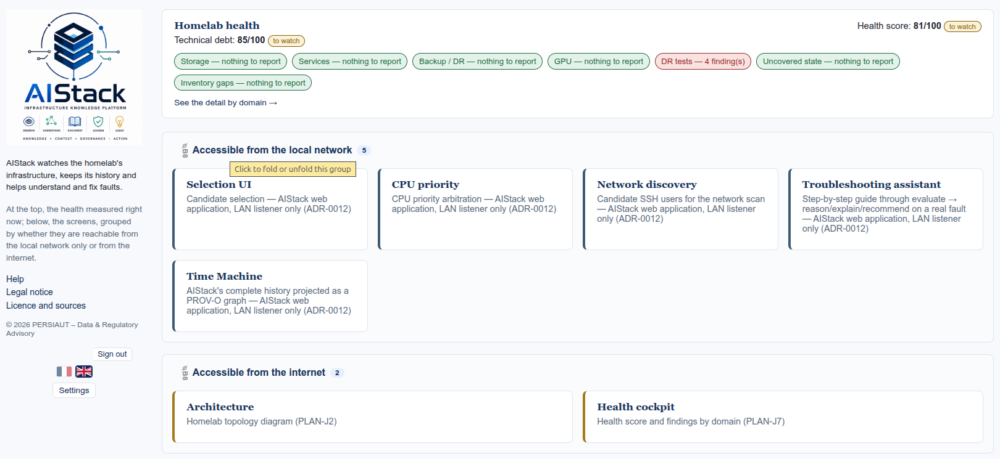
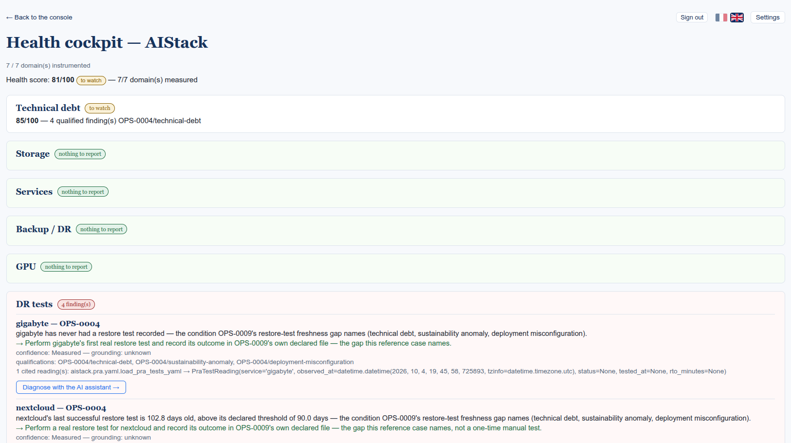
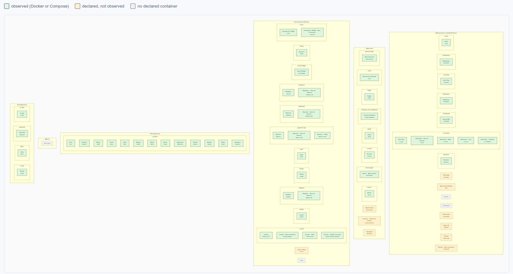
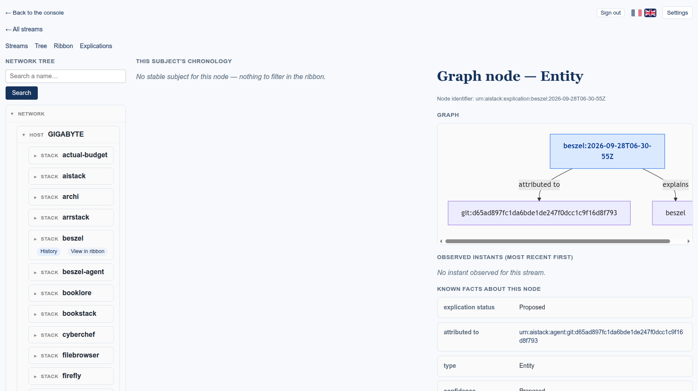
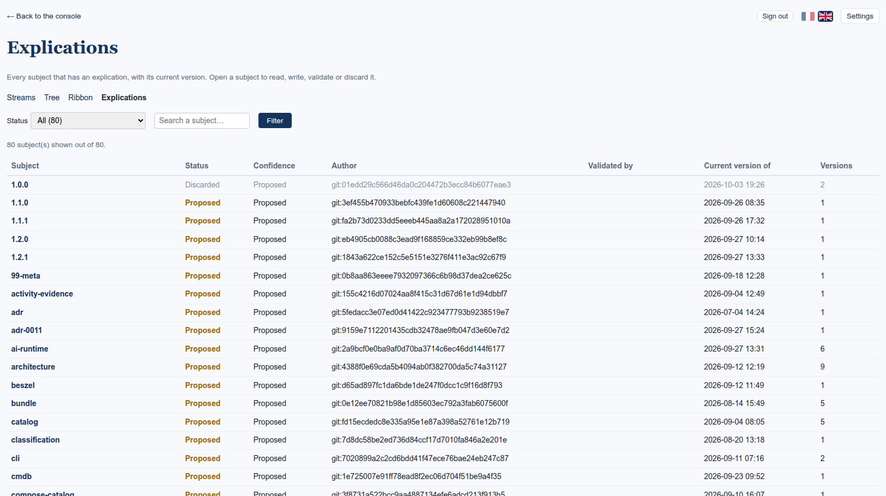
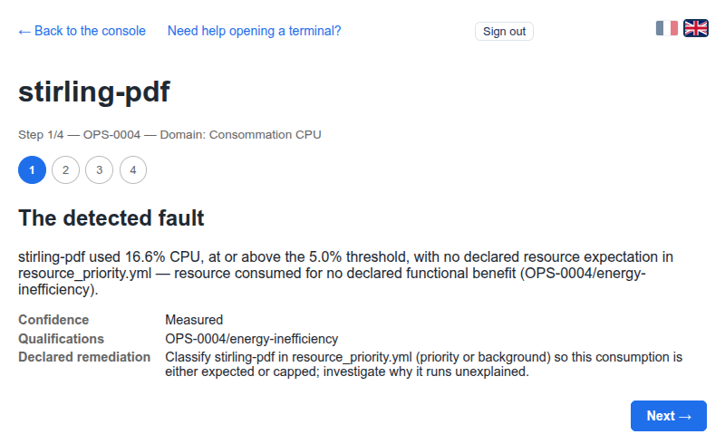
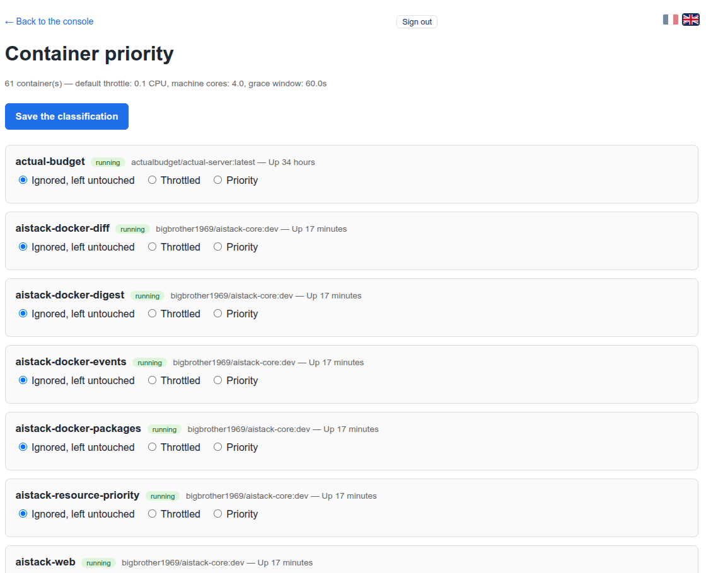
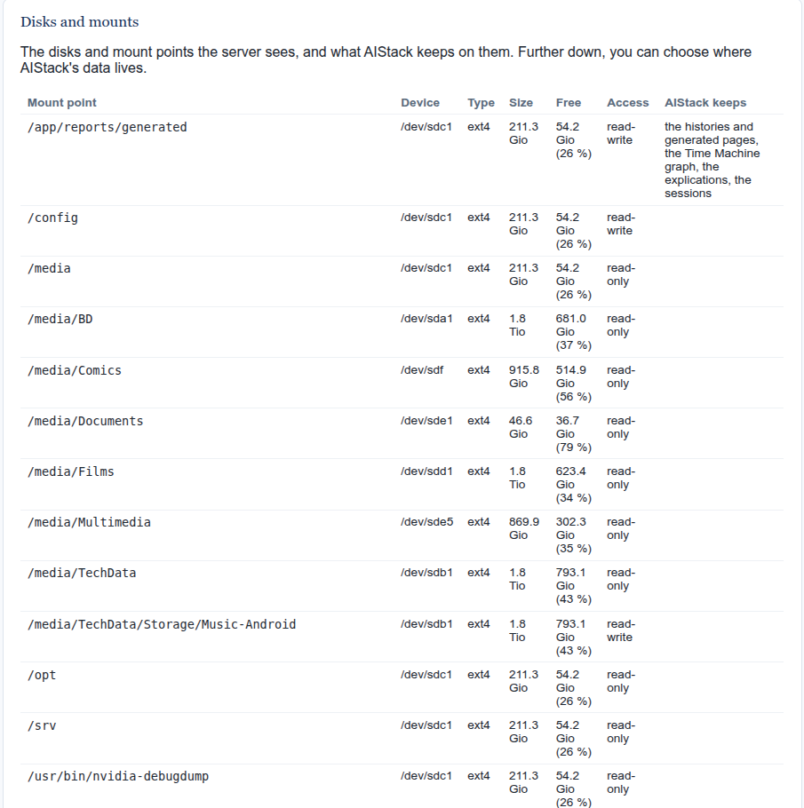

---
artifact:
  id: README-AISTACK
  owner: Foundation
  status: Draft
  title: AIStack Main README
  type: Entry Point Documentation
  semantic_type: Knowledge Artifact
  domain: Foundation
  criticality: C2
  confidence: Declared
  version: 11
  created: 2026-07-04
  updated: 2026-10-08
---

# AIStack

[](LICENSE.txt)

**AIStack** is an open-source **Infrastructure Knowledge Platform (IKP)** designed to transform digital infrastructures into governed, explainable, portable, and sustainable knowledge.

*IKP is the category this project presents itself in. What AIStack **is** is
defined once, in `FDN-0002` § *AIStack*: a semantic system for building,
governing and exploiting the Governed Heritage of Digital Ecosystems. The
architecture it is built toward is named a Knowledge Operating System —
`ARCH-0010`.*

AIStack does not aim to build the most powerful infrastructure.

**Its ambition is to build the best understood and most sustainable one.**

---

# Human Guide

## Why AIStack?

Modern information systems have become increasingly complex.

Their knowledge is often:

- scattered across multiple tools;
- partially undocumented;
- dependent on individuals;
- difficult to maintain;
- difficult to transmit.

AIStack addresses this challenge by transforming infrastructure knowledge into a governed and sustainable heritage.

The objective is not merely to operate infrastructures.

The objective is to **understand**, **preserve**, and **transmit** them.

---

## What AIStack Does

AIStack watches a self-hosted infrastructure, keeps what it observes as
governed, dated knowledge, and helps the person who runs it understand,
explain and act on it:

- **Observe** — discover what really runs (Docker hosts, Compose stacks,
  the machines of the local network) and collect evidence about it
  continuously.
- **Check** — score the infrastructure's health against declared,
  grounded expectations, and say plainly where it falls short.
- **Remember** — keep every observation, decision and explanation with
  its date and its origin, never overwritten, in a provenance graph.
- **Explain** — record *why* things are the way they are, whether a
  commit, a model or a person said so, and let people confirm or set
  aside each explanation.
- **Assist** — reason about a real finding with a local AI model, never
  as a source of truth, and apply only the fixes this project trusts a
  button to make.
- **Govern** — every rule, decision and figure lives in versioned,
  integrity-checked documentation, so the infrastructure's knowledge
  outlives any one person or session.

AIStack transforms observations into sustainable knowledge assets.

### Concrete capabilities, as of 1.11.0

- **What changes on the hosts themselves — new as of 1.11.0** — a
  collector on each host (GIGABYTE and the Raspberry on the reference
  installation), one file using the Python standard library only, run
  by systemd every 15 minutes as root but read-only and with no network,
  records every package installed, upgraded or removed (with eight
  months of history taken from the hosts' own logs at the first run),
  every apt run and who asked for it, every file added, removed or
  modified under `/etc`, `/usr/local/bin` and `/usr/local/sbin`, in the
  crontabs and among the compose and `.env` files of the projects, and
  every systemd unit enabled or disabled. A file is known by its size,
  mode, owner and a fingerprint keyed with the host's own secret — never
  by its content. The Time Machine shows each host as its own lane in a
  *Hosts* group; `python -m aistack.cli.hosts` says when each collector
  last ran and whether one has gone silent.
- **Governed image updates, the Quai — as of 1.10.0** — a service
  declared in `dock.yml` (WordPress on the reference host) no longer
  updates itself at night: the Quai page shows when a newer image is
  published for the tag it runs, an administrator proposes the update
  with its reason in writing, and another validates it (one may do both
  while AIStack is being set up). An executor on the host then takes it:
  a sandbox restore of the latest backup within the last 24 hours, the
  new image fetched by its registry digest and rehearsed in the sandbox,
  the previous image kept, the container recreated with its own compose
  project, checks on the live service — and the previous image put back
  if they fail. Each step shows on the page as it runs; the reason is
  recorded in the Time Machine as the change's explication, and the
  change enters the provenance graph with the people behind it, the
  images before and after and its outcome. The web container answers a
  healthcheck, so `docker ps` and dashboards reading Docker show it
  `healthy`.
- **Restore tests in a sandbox — as of 1.9.0** — one command on the
  host restores a service's latest backup beside the running service,
  never in its place: its own internal Docker network, no port, its own
  throwaway passwords, the same image the service runs, everything
  removed at the end but the report. It checks what was restored (the
  site answers, the tables are there, a photo taken back from the backup
  matches its database), measures the real time to recovery and proposes
  the PRA-test entry — which enters `pra_tests.yml` only once the owner
  agrees. Recipes for WordPress, Nextcloud, Immich and AIStack itself; on
  the reference host all four were tested this way on 2026-10-08. On
  demand, the restored backup is compared with the running service (rows
  per table, files per folder, no verdict), and going back to the image a
  container ran before its last upgrade is rehearsed the same way before
  it is done by hand. AIStack backs itself up every night (data,
  declarations, environment), and the Health Cockpit's two score badges
  lead to an action plan: what to do first, ranked by what it gains.
- **Ready to run from Docker Hub — as of 1.8.0** — one image,
  `bigbrother1969/aistack-core`, runs the whole of AIStack: the web
  application and the five collectors are six services of one
  `docker-compose.yml`, on the host's network, reading their
  declarations from `./config` (copied at first start, never
  overwritten) and keeping their data in one directory. A new
  installation starts on the reference host's values and says, on every
  page, what is still to declare — host, identity provider, client
  secrets — until it is. From Settings, an administrator sees every disk
  and mount the server has and picks the disk AIStack's data should move
  to; AIStack shows the commands and never moves anything itself. A user
  manual, reached from Help, describes every screen and the setup. The
  reference host runs this way since 2026-10-04.
- **One web application, signed in — as of 1.7.0** — the console and
  every screen (Architecture, Health Cockpit, Priority CPU, music
  selection, network discovery, the troubleshooting assistant, the Time
  Machine) are one application, every route of it in the test suite. It
  answers on two addresses: the public one, reachable from the internet,
  and the local network's. People sign in with the owner's identity
  provider (Pocket ID, OpenID Connect); a fallback administrator account
  exists on the local network only, for when the provider is down.
  Signed out, only the console, help and legal pages are public;
  Architecture and the Health Cockpit need a session, and the screens
  that change something stay on the local network. Two profiles, from the
  provider's groups: an **administrator** reads and acts, a **user** reads
  only; every action carries a token bound to the session. Settings show
  each person their profile and session, and show an administrator every
  open session (and can close it) and a 30-day sign-in journal. Every
  control on every page says what it does when hovered.
- **Docker infrastructure discovery** — a governed catalog of a live
  Docker host: identity, image, state, ports, mounts, and the real
  `depends_on:` relationships between containers, regenerated from the
  host itself every time.
- **Architecture, visualized** — `architecture.html` renders that same
  discovery as a self-contained topology graph, plus a Docker dependency
  view, a section naming the external network topology and each
  machine's hardware, a live Beszel health-metrics section, and a
  real-time section asking every declared HTTP endpoint on the homelab
  for its status right now.
- **Network-wide Docker discovery** — an explicitly-triggered LAN scan,
  over SSH, that reports Docker containers running on machines other
  than the one AIStack itself runs on, with a LAN-only screen to manage
  the candidate SSH usernames it tries.
- **Health Cockpit** — a scored dashboard across seven domains (Storage,
  Services, Backup/DR, GPU, PRA tests, persistent state, inventory gaps),
  plus a separate technical-debt card, each instrumented against a real
  incident or a real declared threshold. As of 1.6.0: the homelab's
  operational inventory is declared and checked against what actually
  runs — a per-service backup strategy (SQL dump, stop-and-archive, or
  live file backup, each grounded in a real script or tool, a missing
  one flagged rather than guessed), an inventory reconciliation in both
  directions between declared services and the containers really
  discovered on the network, and a PRA-test list proposed from that
  discovery, where a stateful service with no restore test on record is
  flagged and a result only ever comes from a real test. Every finding
  in red is a link into the troubleshooting assistant. As of 1.6.1:
  the Services domain also counts restarts over the last hour from the
  Docker event history, so a container crash-looping while reading
  "running" between two crashes is flagged, not missed. As of 1.8.0:
  the technical-debt card costs a domain's weight once per domain
  carrying debt, so it moves when a domain is cleared; a service started
  only on demand is no inventory gap when stopped. As of 1.9.0: a backup
  disk that cannot be read, or does not answer, is a finding, never a
  page that fails to render; code waiting in quarantine before deletion
  counts as technical debt; a declaration shipped with a new version is
  taken automatically when yours is untouched, and shown in Settings when
  you changed it.
- **Runtime diagnosis** — a sweep of the Docker host, no container
  named, qualifies log lines against declared signatures, correlates
  unexplained CPU consumption against host temperature and against the
  container's own logs (to tell a container plausibly at rest apart
  from one merely unclassified but busy), and flags development options
  (like `--reload`, the bug that started this capability) left enabled
  in a service — grounded, where declared, against the same lifecycle
  context every finding type now reads.
- **AI Runtime and a guided troubleshooting assistant** — a real
  qualified finding can be reasoned about, explained in plain language
  (in French), and given a suggested next step by a local Ollama model —
  never a source of truth, never an executor on its own, by design of
  the prompts themselves, not only the surrounding code. A step-by-step
  guided screen walks a real finding through that chain and can apply
  the one safe, single-click fix this project trusts a button to make
  (declaring a container "background" in the resource-priority
  definition), always re-verified against a fresh diagnostic afterward
  rather than assumed to have worked. Every reasoning call is kept in a
  durable, per-subject history. As of 1.6.0: the assistant reads every
  finding the Health Cockpit raises, not only CPU and temperature —
  still applying a fix by itself only for the one CPU-priority action it
  was built for.
- **Console** — one entry point to every screen, each card described for
  the person using it, in plain French, and grouped by whether it is
  reachable from the local network or from the internet; a domain's
  alert badge opens the matching section of the Health Cockpit, and every
  address AIStack links to is read from one declared instance
  configuration. As of 1.7.0: it shows who is signed in, and its licence
  page gives the published Docker image and the command to pull it.
- **French and English interface** — every page (console, Settings,
  Architecture, Health Cockpit and every screen) switches between French
  and English, the choice following the visitor from page to page. The
  AI Runtime's own answers follow it too: enforced by a second, fast
  model's translation pass whenever the display language is not English.
- **Time Machine and Explications** — AIStack's own histories projected
  as a PROV-O provenance graph (Oxigraph), rebuilt in full on demand and
  browsed on the local network; and Explications, the recorded *why* of
  each subject. What each version brought:
  - **1.3.0** — the graph itself: five histories projected as a real
    PROV-O graph, browsable by stream, by the instants each one
    recorded, and by every fact known about one instant, with the
    provenance edges back to whoever or whatever caused it.
    Explications are read for the first time from four real sources:
    the AI Runtime's own answers, `pra_tests.yml`'s dated comments, this
    project's `claude/` session notes, and its commit history.
  - **1.4.0** — a foldable network tree (Réseau → Hôte → Stack →
    Conteneur, with search) read from the live Docker/Compose catalogs,
    and a Mermaid provenance diagram on every node page, centred on the
    node being viewed.
  - **1.5.0** — three passive collectors feed the graph in real time:
    Docker events (exec, pull, create, recreate, destroy), periodic
    `docker diff` (filesystem drift since creation, mount noise filtered
    out) and image-digest drift (a purely local upgrade signal, no
    registry call) — each its own governed systemd poll, a stream's
    collection gaps recorded as a fact when it stops and restarts.
  - **1.5.1** — a fourth collector, package inventory (`dpkg`/`apk`,
    `"none"` rather than a silent empty list); the time ribbon, a
    chronological, per-stream-filterable, gap-aware view across every
    stream; and an upgrade correlation linking the package inventories
    nearest before and after each image-digest change.
  - **1.5.2** — the ribbon gains a real per-category time axis,
    label-aware clustering with a whole-lane summary for very
    high-volume streams, touch support, a by-name cross-link with the
    network tree in both directions, and a filter that survives a
    language switch; every page shares one adaptive layout and one
    charte graphique.
  - **1.6.0** — a node's page shows the network tree, that subject's
    chronology and its facts side by side; *Reconstituer* shows a
    subject as it stood at a past instant, stream by stream, saying so
    honestly where nothing was observed yet; *Pourquoi* lists a
    subject's Explications, version by version, read-only; a ribbon
    cluster unfolds into its members, and the full list is paginated and
    grouped by stream.
  - **1.6.1** — the Docker event stream keeps what a person or a real
    state change caused, leaving out AIStack's own probes and declared
    healthchecks (99 % of it on the reference host); package inventories
    once per image, filesystem drift every 15 minutes; earlier history
    archived and refiltered in one command; and the graph rebuilds in
    about a minute instead of scanning its history quadratically.
  - **1.7.0** — the Time Machine moves into the one web application,
    behind sign-in. The *why* is no longer only imported: an
    administrator **writes** an Explication (recorded as `Declared`,
    waiting for a second person), **validates** one written by someone
    else or imported (the validator becomes a second author), or
    **discards** one with a stated reason — every act one more version,
    nothing ever deleted, and the graph links each version to the one it
    revises at its next rebuild. A new **Explications** view lists every
    subject that has one, filtered by status and by name.
  - **1.8.0** — while an instance is in its development phase, what an
    administrator writes is validated as written and test entries can
    be purged; the strict two-person rule returns in production
    (`ADR-0016`). AIStack's own containers appear in the tree and the
    streams like any other Compose project.
- **Knowledge integrity validation** — eighteen checks run against the
  governed documentation on every test suite and before every
  publication.
- **CPU resource priority scheduling** — declared priority applications
  get more CPU while active and give it back once idle, background
  containers throttle down for the duration, and every decision is
  recorded.
- **Music sync selection** — choosing, under a real capacity limit, what
  part of a media library syncs to a device.

**Full history of what changed release by release: `docs/03-handbook/RELEASE-NOTES.md`.**

---

## Screenshots

*Taken on the reference host, 1.8.0, in English; names and addresses
masked.*

**The console** — the health frame on top (score, technical debt, one
badge per domain), the screens below, grouped by whether they are
reachable from the local network or from the internet.



**The Health Cockpit** — seven domains, the technical-debt card, and
every finding with its interpretation, its remediation, its
qualifications and the reading it cites; each one opens in the
troubleshooting assistant.



**Architecture** — the homelab's services by category, observed in
Docker or Compose, declared but not observed, or with no container of
their own.



**Time Machine — a node** — the network tree, the subject's chronology,
and the node's facts with its provenance graph (here, an Explication
attributed to the commit that wrote it).



**Explications** — every subject that has a recorded *why*, its status,
confidence, author and validator, filtered by status and by name.



**Troubleshooting assistant** — a real finding walked through step by
step; here the local AI model's reasoning about it, an explanation never
taken as a source of truth.



**CPU priority** — every container classified as left alone, throttled
or priority, AIStack's own six among them.



**Settings — disks and mounts** — what the server sees from inside the
container, its free space, and what AIStack keeps where.



---

## Quality Approach

Nothing ships on the strength of one look. Three governed gates run before
any change is published, and each exists because something specific once
got past its absence.

- **Tests, "cave au grenier."** Every generator has its own test, asserted
  through its own `generate()` — not only through the shared utility it
  calls or the CLI command that drives it at the front door. The project's
  own phrase for this, from the test suite itself: *"cave au grenier" per
  generator, not just at the shared utility and at the CLI's front door* —
  written after four provider CLIs raised on their second line for forty
  days, unnoticed, because nothing had ever imported them end to end.
- **Static checks — ruff and mypy.** `ruff check src tests` and `mypy src`
  run on every patch, alongside the test suite. Adopted 2026-09-10, after
  evaluating both against this codebase: on their very first run, before
  either had a configuration file to tune them, mypy found two real defects
  (an incompatible method override, two builders passing the wrong
  container type) and ruff found a genuine `zip()` truncation risk and
  four regex-escaping ambiguities in test assertions — not hypothetical
  findings, real ones, still in the commit history.
- **Publication — governed, and never automated.** `docs/04-development/
  OPS-0002-Heritage-Publication.md` states the procedure command by
  command. Before an image is built: a clean tree, on `main`, `HEAD` equal
  to `origin/main`, and `ruff`, `mypy`, `pytest` and the knowledge-integrity
  validator all clean — four preconditions, each refusing a different way
  of publishing something nobody could check. Every previous "current"
  image is re-pulled and its digest re-verified before a new one is built,
  so a published tag cannot quietly drift from what it once meant
  (`GOV-0002/OS-047`). Published images are pinned by digest in
  `docker-compose.yml`, one comment block per version, and a retracted or
  superseded entry is kept and explained, never deleted. The agent that
  helps write this heritage never builds or pushes an image itself — by
  design, not caution: the owner authenticates to the registry personally,
  for this step as for every other.

- **Verified twice, on two machines.** The same chain — `ruff`, `mypy`,
  `pytest`, the knowledge-integrity validator — runs on the workstation
  before a change reaches the SPOT, and again on the publisher right
  after it pulls, before `sync_mirrors.sh` may publish to GitHub and
  Codeberg. A commit no machine has verified never reaches a mirror, and
  the publisher's run is the one the image build relies on (OPS-0002).
- **The image is the product, from 1.8.0.** It now runs the whole
  application, so the published tag is what people actually run: it is
  built only from a commit both machines verified, labelled with that
  commit (`org.opencontainers.image.revision`), pushed under its version
  and as `latest`, and the reference host itself runs that exact image
  through `docker-compose.yml` — the first user of every release.

**As of 1.11.0**: `pytest -q` — **3325 passed**; `ruff check src tests` —
all checks passed; `mypy src` — no issues found in **641 source files**;
`python3 -m aistack.cli.knowledge_integrity` — **87 knowledge artifacts**,
`blocking: 0 warnings: 0 clean: True`.

The metrics quoted above and in `docs/03-handbook/RELEASE-NOTES.md` — test
counts, artifact counts, `clean: True` — are recorded by hand at each
publication, read off that publication's own `pytest`/knowledge-integrity
run. There is no CI pipeline in this repository yet to record them
automatically on every push; today's discipline is manual, applied
consistently rather than enforced by a hook.

---

## Core Principles

AIStack is built upon a small set of fundamental principles:

- Knowledge before Artificial Intelligence.
- Observation before Understanding.
- Governance before Automation.
- Architecture before Implementation.
- Documentation First.
- Generated artifacts are disposable.
- Sustainability over complexity.
- Explainability before optimization.
- Open standards before vendor lock-in.

---

## High-Level Architecture

```text
Applications
        │
        ▼
Interfaces
        │
        ▼
Kernel Services
        │
        ▼
Kernel
├── Engines
├── Registries
├── Repositories
└── Capabilities
```

The Kernel orchestrates the platform.

Capabilities implement technical operations.

Providers observe infrastructures.

Knowledge Artifacts preserve governed knowledge.

---

## How to install

AIStack runs **on the host it observes**: it reads the Docker socket,
the host's disks and its containers, and serves pages generated on that
host. It installs two ways: **with Docker** — the published image
(`bigbrother1969/aistack-core`) runs the whole application, six services
of one image, see *With Docker* below; the reference host (GIGABYTE) runs
this way — or **from a git checkout**, with a Python virtual environment
and systemd units, described first.

### Prerequisites

| What | Why | Notes |
|---|---|---|
| A Linux host with **systemd** | every AIStack service is a systemd unit | the reference host runs Debian-based Linux |
| **Docker** and **Docker Compose** | AIStack observes the containers on this host | the account AIStack runs as must be in the `docker` group — it never needs root |
| **Python 3.13** | the only version this code is verified on (`requires-python`) | most distributions ship an older `python3`; install 3.13 alongside it |
| **git** | installation and updates come from the repository | |
| An **OpenID Connect provider** — the reference host uses **Pocket ID** | people sign in with it (`ADR-0013`) | reachable over HTTPS from the host *and* from the browsers; must announce `RS256`, PKCE `S256` and a `groups` claim |
| A **reverse proxy with TLS** (the reference host uses Nginx Proxy Manager, behind Cloudflare) | the public address | it points at the public port (8183) only — **never** at the local-network port |
| *Optional:* **Ollama** on the host | the AI Runtime and the troubleshooting assistant | `ai_runtime.yml` names the endpoint and models |
| *Optional:* **Syncthing** | the music-selection screen | its API key goes in `.env.web` |
| *Optional:* **Beszel** | the health-metrics section of Architecture | |

### Precautions

- **Two ports, two audiences.** `service_ports.console` (8183) is the
  public listener; `service_ports.web_lan` (8186) answers every screen,
  including those that change the host (CPU priorities, SSH user names,
  fixes). Publish 8183 through the proxy; never publish 8186, and keep it
  reachable from the local network only (firewall).
- **Secrets stay in `.env.web`**, at the repository root, never
  committed (`.gitignore` already excludes it). Append to it without
  displaying it (`read -rs`, `>> .env.web`), and keep it readable by the
  service account only (`chmod 600 .env.web`).
- **Docker group = root-equivalent.** The account in the `docker` group
  can control every container; give it to the AIStack service account
  and nobody else.
- **Back up what AIStack keeps**: `reports/generated/` (histories,
  explications, the sessions database, the graph) and `.env.web`. The
  graph can be rebuilt; the histories cannot.
- **Start in the development phase.** `instance_config.yml`'s
  `phase: development` lightens the Explication rules while you set
  AIStack up (`ADR-0016`); set `phase: production` when people other than
  you start using it.

### 1. Get the code and the environment

```bash
sudo mkdir -p /srv/aistack && sudo chown "$USER": /srv/aistack
cd /srv/aistack
git clone https://github.com/bigbrother1969-bis/AIStack.git    # or Codeberg
cd AIStack
python3.13 -m venv .venv
.venv/bin/python -m pip install --upgrade pip
.venv/bin/python -m pip install -e ".[dev]"
source scripts/dev-env.sh
pytest -q && python -m aistack.cli.knowledge_integrity      # must end with clean: True
```

### 2. Declare your instance

The declarations live under `src/aistack/*/definitions/`; the values in
the repository describe the reference host. Review at least:

| File | What to set |
|---|---|
| `instance/definitions/instance_config.yml` | `lan_hostname` (this host's name on the LAN), the two ports, `phase` |
| `authentication/definitions/authentication.yml` | `issuer` (your OIDC provider), `public_base_url` (your public address), `admin_group` |
| `architecture/definitions/infrastructure_topology.yml` | your machines and network |
| `network_discovery/definitions/network_discovery.yml` | the LAN range to scan |
| `console/definitions/console_links.yml`, `console_identity.yml` | the console's cards and its identity |
| `architecture/definitions/service_categorization.yml`, `cmdb_probe_targets.yml` | your services and the endpoints to probe |
| `backup_strategy/…`, `pra/…`, `priority/…`, `providers/*/…thresholds.yml` | backups, restore tests, CPU priorities, thresholds |
| `ai_runtime/definitions/ai_runtime.yml` | the Ollama endpoint and models, if you use it |

### 3. Create the client in the identity provider

In Pocket ID (or any OIDC provider):

1. Create a **group** named exactly as `admin_group` says
   (`aistack_admins`) and add the administrators to it — the *name*, not
   the display name, is what the token carries.
2. Create a **confidential client** with PKCE, and declare **four**
   addresses — providers compare them letter for letter:
   - callback URLs: `https://<public address>/auth/callback` and
     `http://<lan_hostname>:<web_lan>/auth/callback`;
   - after-logout URLs: `https://<public address>/console.html` and
     `http://<lan_hostname>:<web_lan>/console.html`.
3. Allow the group (and any reader group) on the client.

Then write the client's credentials and the fallback administrator's
password hash into `.env.web`, without showing them:

```bash
read -rs -p "Client ID: " V && echo "AISTACK_OIDC_CLIENT_ID=$V" >> .env.web && unset V && echo
read -rs -p "Client secret: " V && echo "AISTACK_OIDC_CLIENT_SECRET=$V" >> .env.web && unset V && echo
python -m aistack.cli.web_admin_password >> .env.web    # asks twice, prints only the hash
chmod 600 .env.web
```

The fallback administrator signs in on the local network only, for when
the provider or the proxy is down.

### 4. Install the services

Each unit under `deploy/systemd/` names `User=big-brother` and
`/srv/aistack/AIStack`: edit both to your account and path first.

```bash
sudo cp deploy/systemd/aistack-*.service /etc/systemd/system/
sudo systemctl daemon-reload
sudo systemctl enable --now aistack-web
sudo systemctl enable --now aistack-docker-events-monitor aistack-docker-diff-monitor \
  aistack-docker-digest-monitor aistack-docker-packages-monitor aistack-resource-priority-monitor
ss -ltnp | grep -E ':8183|:8186'          # both listeners answer
```

### 5. First pages and first graph

```bash
python -m aistack.cli.architecture_render
python -m aistack.cli.health_render
python -m aistack.cli.console_render
python -m aistack.cli.explications_import          # and the other explications_import_* sources
python -m aistack.cli.timemachine_rebuild
```

Open `http://<lan_hostname>:<web_lan>/` on the local network, sign in,
and check *Settings*: your profile must read **Administrator**. The
user manual (*Help* in the console) walks through every screen.

### Updating

```bash
cd /srv/aistack/AIStack && git pull
source scripts/dev-env.sh
.venv/bin/python -m pip install -e ".[dev]"
pytest -q && python -m aistack.cli.knowledge_integrity
sudo systemctl restart aistack-web
```

### With Docker (from 1.8)

From 1.8 on, the image runs AIStack itself (`ADR-0017`): the web
application and the five collectors are six services of
`docker-compose.yml`, one image, on the host's network, with the Docker
socket, a configuration directory and a data directory. The
prerequisites, precautions, declarations and identity-provider steps
above are the same; the services replace step 4.

```bash
mkdir -p /srv/aistack && cd /srv/aistack
curl -fsSLO https://raw.githubusercontent.com/bigbrother1969-bis/AIStack/main/docker-compose.yml
curl -fsSLO https://raw.githubusercontent.com/bigbrother1969-bis/AIStack/main/.env.example
cp .env.example .env               # AISTACK_VERSION (1.8.0 or later), your user and group ids, the socket's group
mkdir -p config data               # created by you, so your account owns them
touch .env.web && chmod 600 .env.web
docker compose pull && docker compose up -d
```

At first start `./config` receives every declaration AIStack ships,
with the reference host's values. AIStack starts on them, and every
page shows **⚠ To configure** until the host, the identity provider and
the OpenID Connect client are declared: the link opens `/setup`, which
says what is left, in which file, and the values in use today. Edit
them in `./config` and `.env.web` (step 2 above), then
`docker compose restart`. Add, at
the end of `x-aistack`'s `volumes:`, every host directory your
declarations name, at the same path, read-only. One-off commands run in
the image:

```bash
docker compose exec web python -m aistack.cli.web_admin_password   # then paste the line into .env.web
docker compose exec web python -m aistack.cli.health_render
docker compose exec web python -m aistack.cli.timemachine_rebuild
docker compose run --rm validate                                     # the knowledge-integrity validator
```

Never run the compose services and the systemd units on one host.
`docker-compose.yml` also records every published image by digest.

**Upgrading** to a newer version: set it in `.env`
(`AISTACK_VERSION=…`), then `docker compose pull && docker compose up -d`.
Your `./config` and data are kept; a declaration a new version brings is
added at the next start. A declaration a new version *changes* follows it
when you never edited your copy; when you did, your file is kept and
Settings → *Shipped declarations* shows the difference and the command
that takes the new one.

**Moving a git + systemd installation to compose** (`ADR-0017` § 5),
from the checkout, which stays and keeps the data where it is:

```bash
./scripts/compose_preflight.sh                       # reads, changes nothing
mkdir -p config/examples/selections
find src/aistack -path '*/definitions/*.yml' -exec cp {} config/ \;   # your 18 declarations, placed before the first start
cp -a examples/selections/. config/examples/selections/
printf 'AISTACK_VERSION=dev\nAISTACK_UID=%s\nAISTACK_GID=%s\nDOCKER_GID=%s\nAISTACK_DATA_DIR=%s\n' \
  "$(id -u)" "$(id -g)" "$(stat -c %g /var/run/docker.sock)" "$PWD/reports/generated" > .env
cp docker-compose.override.example.yml docker-compose.override.yml   # then adapt it
docker compose build && docker compose config --quiet
sudo systemctl disable --now aistack-web aistack-docker-events-monitor aistack-docker-diff-monitor \
  aistack-docker-digest-monitor aistack-docker-packages-monitor aistack-resource-priority-monitor
docker compose up -d
```

The way back: `docker compose down`, then `sudo systemctl enable --now`
the same six units; copy back from `./config` what a screen saved
meanwhile.

---

## Getting Started (development)

Clone the repository:

```bash
git clone <repository-url>
cd AIStack
```

Generate the AI Context Bundle:

```bash
python3 scripts/export_project_sources.py
```

Run the validation suite:

```bash
source scripts/dev-env.sh
python3 -m compileall src/aistack && pytest -q
```

`bin/aistack_env.sh` declares the execution environment (ADR-0001,
ENG-TEST-0002) and `scripts/dev-env.sh` provides it — it sources the
first, then puts the project virtual environment ahead of the system
interpreter, which on most distributions is not the 3.13 this heritage
is verified on. `pytest` with no argument runs the AIStack suite and
only it: the paths are declared in `pyproject.toml`, per STD-0002.

---

## Project Documentation

The repository contains:

- Foundation documents
- Architecture documentation
- ADRs (Architecture Decision Records)
- Development standards
- Governance rules
- Knowledge artifacts
- Context Bundle
- Roadmap

---

# AI Bootstrap Guide

## Purpose

This section is intended for AI assistants collaborating on AIStack.

Before answering any question related to the project, an AI assistant must first understand the project's governance model.

---

## Acquisition SPOT

The Git repository hosted on Gitea is the **Single Point Of Truth (SPOT)**.

GitHub and Codeberg are publication mirrors. They are not authoritative and shall
never be used as the origin of governed knowledge.

**OPS-0002 states the publication procedure** — which role pushes where, in what
order, and what must hold before each step. Until 2026-08-27 this section
declared the principle and no artifact declared the procedure.

The **Context Bundle** is the official portable projection of the governed
heritage. It is not the SPOT. The most recent Context Bundle supersedes all
previous versions.

A bundle carries its own integrity information in `manifest.json`:

- `source_commit` — the commit the projection was taken from;
- `repository_url` — the canonical location of the SPOT;
- `content_hash` — a fingerprint of the governed knowledge carried: the SHA-256
  of every artifact's own content hash, sorted and written one per line
  (`aistack.context_bundle.manifest.content_hash`). It is derived from contents,
  not from identifiers, and is therefore independent of generation time, machine,
  path and artifact order.

Two bundles sharing a `content_hash` carry exactly the same knowledge. An agent
shall read these fields before reasoning, and shall state which bundle it is
operating from.

*Corrected 2026-09-23, `GOV-0002/OS-065`. The line read "derived from artifact
identities only" — the reading `GOV-0002/OS-021` refused on 2026-08-23, when an
artifact's identity became its governed identifier.*

---

## AI Bootstrap Protocol

Always follow this sequence:

```text
README
    │
    ▼
Knowledge Classification
    │
    ▼
Criticality Evaluation
    │
    ▼
Relevant Context Acquisition
    │
    ▼
Reasoning
    │
    ▼
Response
```

The objective is **not** to load the entire repository.

The objective is to acquire only the governed knowledge required for the current task.

---

## AI Operating Principles

An AI assistant must always:

- Understand before modifying.
- Respect the Single Point Of Truth (SPOT).
- Never invent unknown knowledge.
- Clearly distinguish observations from assumptions.
- Produce explainable reasoning.
- Preserve governance.
- Prefer architectural improvements over implementation shortcuts.

Artificial Intelligence is considered a reasoning assistant, never an autonomous source of truth.

---

## Development Workflow

Every significant modification follows the same governed workflow:

```text
Proposal
      │
      ▼
Validation
      │
      ▼
SPOT Update
      │
      ▼
Git Commit
      │
      ▼
Context Bundle Regeneration
```

Knowledge is always validated before becoming part of the project's heritage.

*This is `FDN-0007`'s Governed Engineering Cycle at the scope of a repository
change. `FDN-0007` is the SPOT of the lifecycle; `FDN-0001` § *Working Workflow*
is its other instance, for Foundation contributions. The last two steps are
carried out by the procedure `OPS-0002` § 1 states command by command.*

---

## AIStack Architectural Model

AI assistants should understand the following responsibilities:

- Applications expose user-oriented functionality.
- Interfaces connect external systems.
- Kernel Services coordinate business operations.
- The Kernel composes platform capabilities.
- Engines perform core reasoning and orchestration.
- Registries maintain governed references.
- Repositories manage persistent knowledge.
- Capabilities implement technical mechanisms.
- Providers observe infrastructures.
- Knowledge Artifacts preserve and transmit knowledge.

Understanding the architecture always takes precedence over writing code.

---

## Engineering Philosophy

AIStack follows a Knowledge-Centric Engineering approach.

Engineering begins with understanding.

Implementation is only one consequence of sufficient understanding.

The platform therefore prioritizes:

- Architecture
- Documentation
- Governance
- Knowledge
- Implementation

rather than the opposite.

---

## Contributing

Contributions are welcome.

Before contributing, please ensure that:

- architectural consistency is preserved;
- documentation is updated when necessary;
- governance principles are respected;
- validation tests pass successfully;
- knowledge remains traceable and explainable.

---

## License

AIStack is licensed under the **GNU Affero General Public License v3.0 (AGPL-3.0)**.

The AGPL v3 guarantees that AIStack and any derivative work remain free and open, including when the software is provided as a network service. Any modifications distributed or made available through a server must also be released under the same license.

For the complete license terms, please refer to the **LICENSE.txt** file included in this repository.

---

## Vision

AIStack is not simply another infrastructure management platform.

Its mission is to transform digital infrastructures into governed, explainable, portable, and sustainable knowledge.

**Knowledge is the primary asset.**

Everything else exists to serve it.
